# Dribble Clone

## Description

Dribble clone developed using django, tailwindcss and jquery/javascript.

## Features

- Add/View/Delete Shots
- Like/Dislike Shots
- Follow/Unfollow dribble clone users
- Add/Remove/View shot feedback
- create/delete collection(TODO)
- Add/Remove shots from collection(TODO)

# Documentation

## Run project

- python -m venv env
- activate environment
- pip install -r requirements.txt
- python manage.py makemigrations {app_name} "start migrating accounts app first"
- python manage.py migrate {app_name}
- python manage.py migrate
- python manage.py runserver

## Shot Add/View/Delete(TODO)
- /
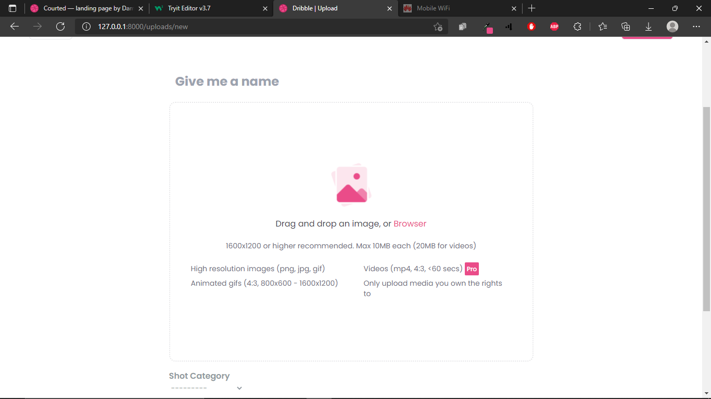

- uploads/new
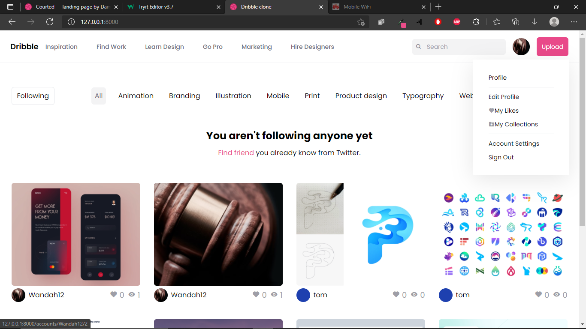

- shot/{shot_uuid}
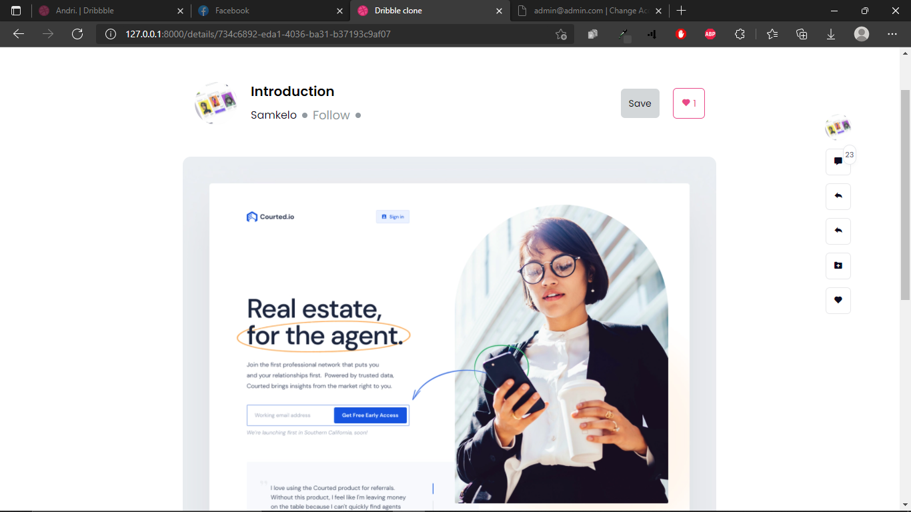

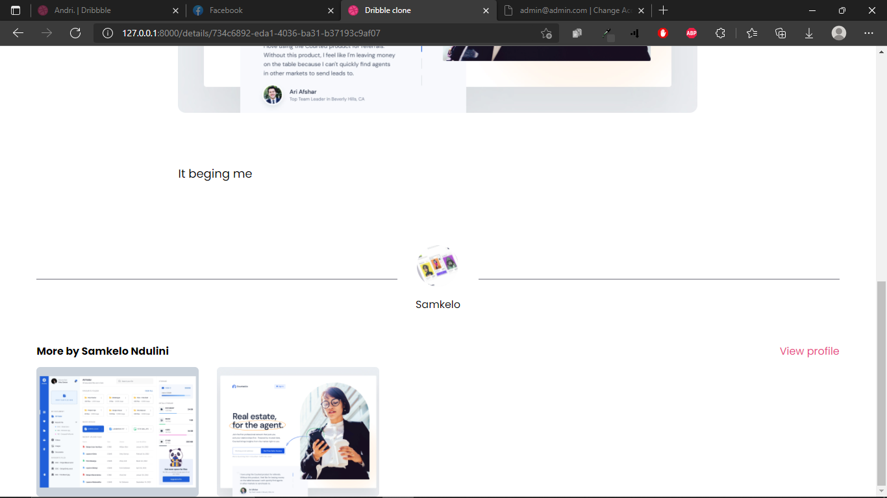

## Account Register/Login/Reset password

- account/login
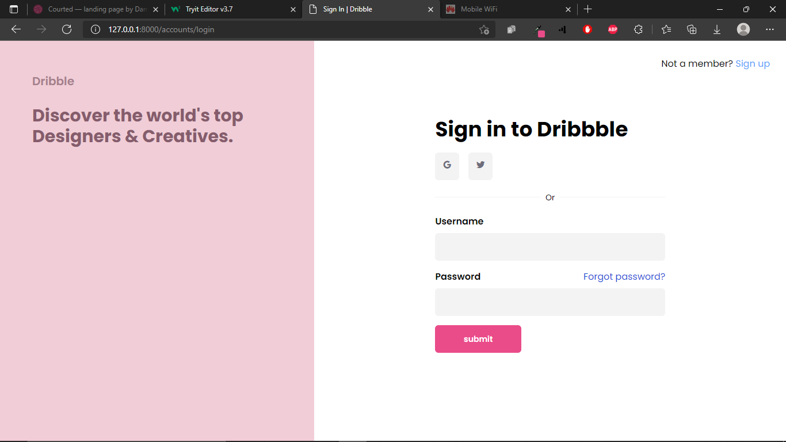

- account/signup
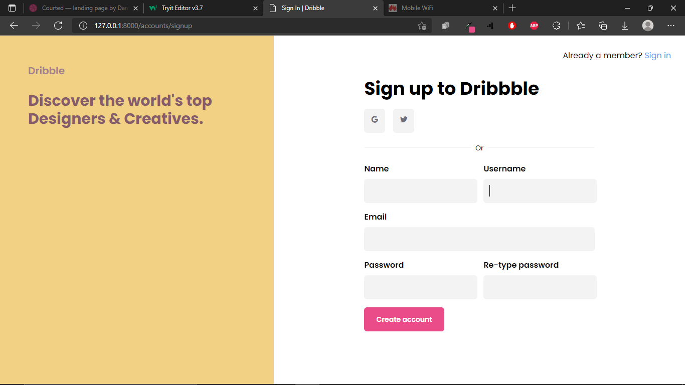

- account/password/reset_password
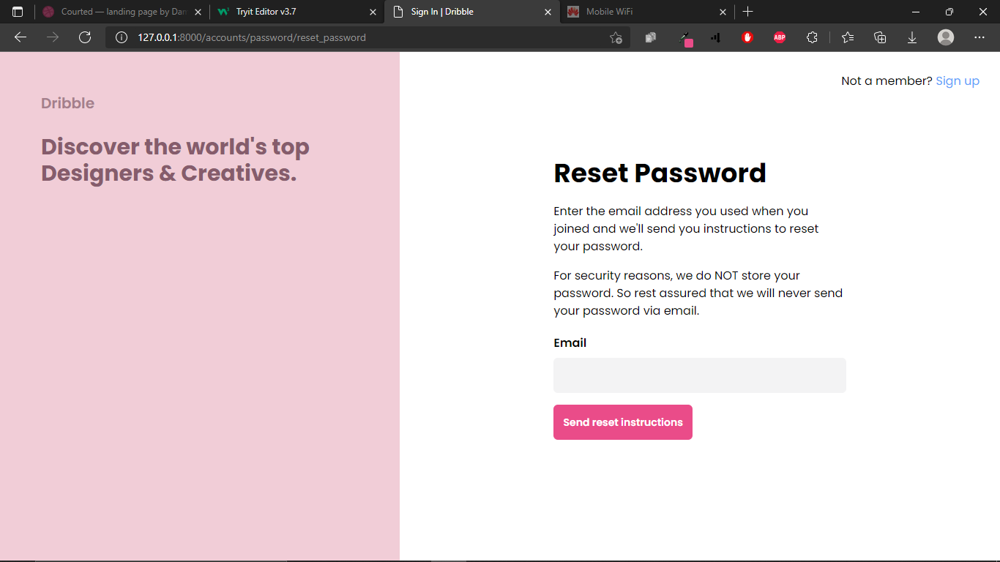

- account/password/token/token
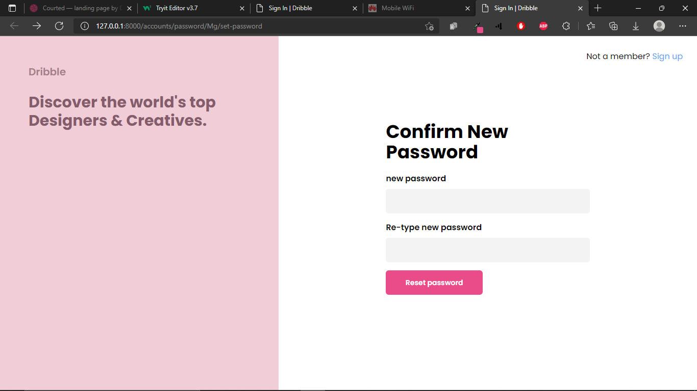

## Account View/Update/Change password/Delete(TODO)

- account/username/id
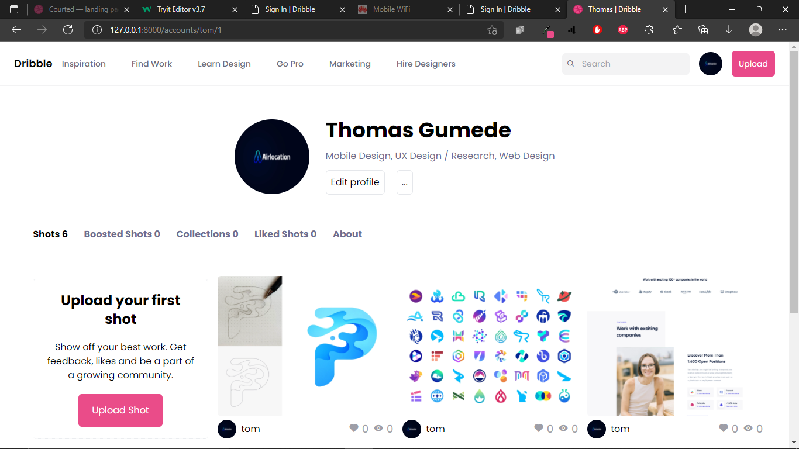

- account/general/username/id
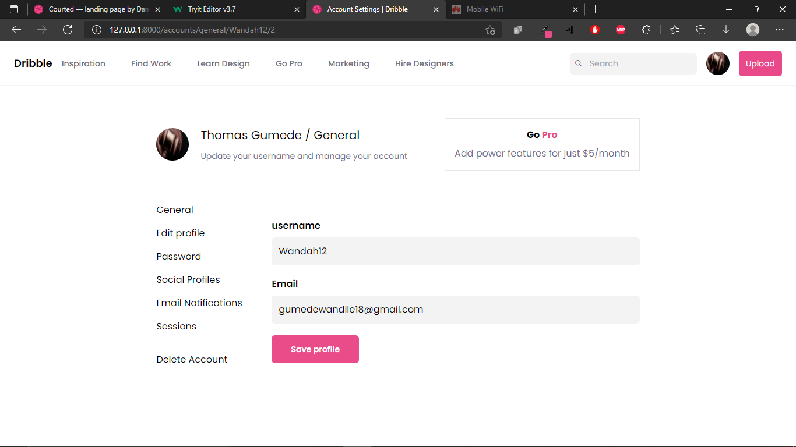

- account/update/username/id
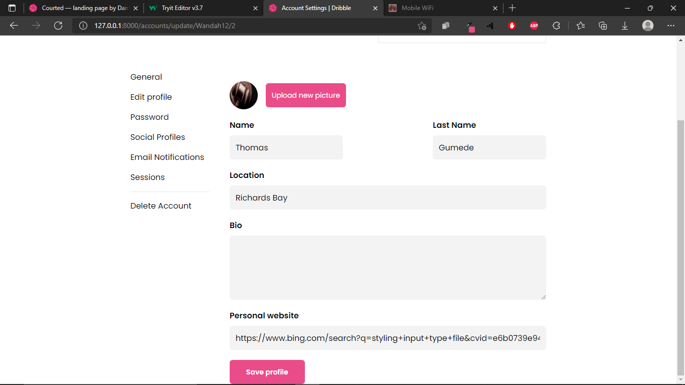

- account/password
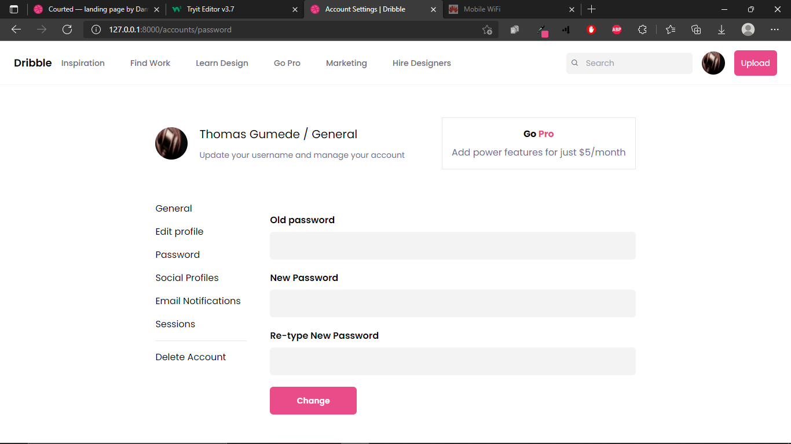

## Like/Dislike Shot

- No styled UI

## Follow/Unfollow Users

- No styled UI